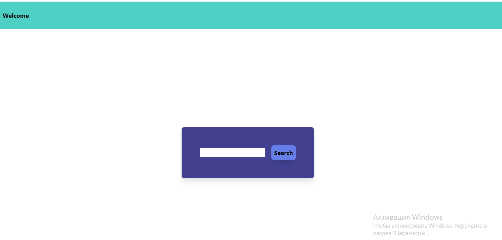

This project can help you to find Readme file from Github Repositories. You just have to type name of GitHub account and choose repo.
Enjoy!


## Quick start

1. Clone this repo using:
  ```shell
  $ git clone git@github.com:ovasylenko/skillcrucial-react-redux-boilerplate.git
  ```

2. To install dependencies and clean the git repo run:

  ```shell
  $ yarn install
  ```

  *We recommend using `yarn` for installing packages, but you can use `npm` instead*:

  ```shell
  $ npm install
  ```
3. Create first build

  ```shell
  $ yarn run build:prod
  ```
4. Copy .env.example file to .env and make the necessary changes there

5. Run project in Dev mode

  ```shell
  $ yarn run dev
  ```

## Features

* Redux
* Modern ES6 for using template strings, JSX syntax, object destructuring arrow functions and more
* Babel for old browser support
* SASS/SCSS: make styles greate again, with no tears
* React Router
* Hot Module Replacement for comfortable development

## Project Structure

#### `client/`

You will write your app in this folder. You will spend most of your time in here.

#### `client/components`

This folder contains all your components

#### `dist/assets`
This directory contains compiled project files

#### `webpack.development.config.js` `and webpack.production.frontend.config.js`
Project environment configs. Webpack uses proper config depending on defined application environment.
By default `webpack.development.config.js` is used unless you build the application with --config webpack.production.frontend.config.js variable.


## Command Line Commands

#### Installation

```Shell
yarn install
```
Installs the dependencies.

#### Development

```Shell
yarn run dev
```

Starts the development server running on `http://localhost:8080` using the webpack.development.config.js with Hot Module Replacement (HMR) (Changes in the application code will be hot-reloaded)

```Shell
yarn run dev:server
```

Starts the development server and makes your application accessible at http://localhost:8080.

```Shell
yarn run clean
```
Removes a directory "dist" from a project

#### Building

```Shell
yarn build:prod
```

Prepares your app for deployment to production environment (using the webpack.production.frontend.config.js) (does not run tests). Optimizes and minifies all files, piping them to the `dist` folder.


#### Testing

```Shell
yarn run test
```

Tests your application modern JavaScript Testing Framework - Jest with the unit tests specified in the `**/__tests__/*.spec.js` files
throughout the application.

```Shell
yarn run test:watch
```

Watches changes to your application and re-runs tests whenever a file changes.

```Shell
yarn run coverage
```

Generates test coverage.


It’s also possible to leave out the run in this command, each script can be executed with its name, e.g:
yarn test:watch
yarn test:coverage

#### Linting

```Shell
yarn run lint
```
Will analyse your code for potential errors. Will check both: `./client/**/**.js` and `./server/**/**.js` files.
Code linting is a type of static analysis that is frequently used to find problematic patterns or code that doesn’t adhere to certain style guidelines.


```Shell
yarn run lint:server
```

Will analyse only  `server/**/**.js` files

#### Docker
Nginx web server working on 443, 80 ports on localhost

```run production
docker-compose -f .\docker\PROD.docker-compose.yml up (Options: --build for build, -d to detach )
docker-compose -f .\docker\PROD.docker-compose.yml down (To stop contaiters)
```
```run develop
docker-compose -f .\docker\DEV.docker-compose.yml up (Options: --build for build, -d to detach )
docker-compose -f .\docker\DEV.docker-compose.yml down (To stop contaiters)
```
